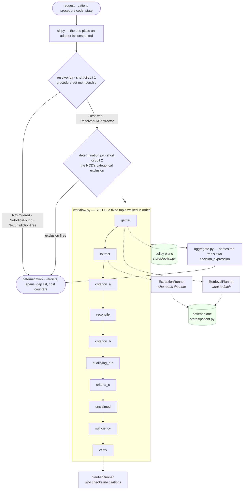

# Prior Authorization Determination Agent

A prior authorization determination system built to work across doctors'
practices. Given a patient record and a requested procedure code, it produces
a reviewable determination: a verdict for every criterion in the governing
policy, a citation for every verdict, and a gap list naming exactly what the
chart is missing. It runs today over **four criteria trees from three
clinical practices and three Medicare contractors**: bariatric surgery under
CMS NCD 100.1 as Noridian Jurisdiction F and Palmetto GBA each implement it,
infliximab for rheumatoid arthritis under Palmetto's L35677, and non-invasive
abdominal and visceral vascular ultrasound under WPS's L35755. The first was
chosen to exercise every part of the engine; the other two were chosen
because they are nothing like it.

The system does not submit, does not decide, and does not adjudicate on a
payer's behalf. It prepares a packet for a human specialist — and the primary
output is the **gap list**, not the verdict. The highest-value sentence the
system produces is "criterion c3 is not supported by this chart," because that
is actionable *before* submission. An overall approve/deny is a summary of the
criterion verdicts and carries less information than they do.

**The rules engine is dynamic — the policy is data, not code.** Nothing in
the engine knows it is adjudicating bariatric surgery. The criteria tree
lives in a reviewed JSON file, the aggregator parses the policy's own
`decision_expression` rather than hardcoding one, and the resolver maps
procedure codes to policies by set membership. A new specialty, payer policy,
or jurisdiction is therefore a new policy file and value set over the same
engine — a change to data under review, not a change to Python. **That claim
is measured rather than asserted.** The four loaded trees differ in *shape*,
not only in constants — one states no run length, another counts a diagnosis
set, a third measures the interval to a prior procedure — and each practice
after the first reused a predicate the engine already had and needed exactly
one it did not. Where a criterion cannot be expressed at all, the engine
declares it unclaimed and abstains rather than approving past it.
*What it measures* below has the account, and *Where this system degrades* is
explicit about what it does and does not prove.

**And it is modular enough to sit inside a practice's back office.** The
application is ports and adapters end to end: two storage ports keep the
policy plane and the patient plane apart, three ports at the model boundary
make every model call swappable and replayable, and the CLI is the single
place an adapter is constructed — nothing else in the system knows where its
data comes from. Patient records are standard FHIR bundles, so integrating
with a production EHR or practice-management system is a second adapter
behind the same ports, with no engine change. The output already matches the
back-office workflow: the gap list tells staff what to chase down before a
request goes out, and the packet gives the reviewing specialist
criterion-level verdicts whose citations slice back into the chart.

This is a proof-of-skill project. Every decision in it is logged, numbered, and
meant to be defensible in a live review, so the reasoning is as much the
deliverable as the code.

From a fresh clone, setup is two commands — Python 3.12, exact pins, no API
key:

```bash
python3.12 -m venv venv
./venv/bin/pip install -r requirements.txt
./venv/bin/python -m pa_agent.cli --patient 49092fd9-d5bf-24e2-474b-00041a279a47 --procedure 43775
```

The last command prints a real determination — seven criterion verdicts, evidence
spans that slice back into the source note, a gap list, and per-run cost
counters — for **zero model calls**, because the default extraction runner
replays a committed recording.

---

## Where the project stands

**v1, v1.1 and v1.2 are all complete.**
76 of 76 tasks closed, 0 open, all ten zero-cost gates green, and acceptance
gates A1–A10 holding. The suite collects 1135 tests (58 skip).

- **v1** delivered the determination end to end: two short circuits, seven
  criterion verdicts over structured FHIR and extracted note events, a gap
  list, a blind verifier, and an eval harness that grades the whole thing
  against labels.
- **v1.1** closed spec §10's eight known limits — a second jurisdiction, a
  bounded re-ask for unanchorable quotes, a second note per chart, a
  citation-sufficiency check, a second measured API tier, and the written-down
  path for the one limit that stays open on purpose.
- **v1.2** asked the question this design exists to answer: **is the engine
  bariatric-shaped?** It made the predicate vocabulary explicit *(T-91)*, then
  compiled two trees from practices the engine had never seen — infliximab for
  rheumatoid arthritis from Palmetto GBA's L35677 *(T-92, T-93)* and
  non-invasive abdominal and visceral vascular ultrasound from WPS's L35755
  *(T-94)* — and closed by generating the account of what that cost
  *(T-95)*. **The answer is in the next section, and it is measured.**

Every figure below is re-derived from `eval/report.md`, which is generated and
gate-verified rather than written.

---

## What it measures, and what that means

This is the section to read. Everything else in this file explains how these
numbers were produced or what they do not cover.

`eval/report.md` owns every measured figure here: it is **generated**, and
`python eval/build_report.py --verify` recomputes each number from the
committed recordings and fails on any that no longer matches — so a stale
figure in this repo is a red gate rather than a plausible-looking table. What
follows is a copy, pinned by `tests/test_docs_consistency.py`.

### Can the engine take a practice it was not written for?

That is the question v1.2 exists to answer, and its five rows answer it with
numbers rather than with an opinion. The account below is generated from the
trees the engine actually loads, in `eval/report.md`'s *Cross-practice
compatibility* section *(T-95, D116)*.

| Practice | Trees | Criteria | By a kind an earlier practice earned | By a kind it earned itself | Declared unclaimed |
|---|---|---|---|---|---|
| bariatric surgery | 2 | 14 | 0 | 12 | 2 |
| diagnostic ultrasound | 1 | 5 | 1 | 1 | 3 |
| rheumatology | 1 | 5 | 1 | 1 | 3 |

**24 criteria across four trees and three practices, zero omitted** — which is
gate A10's first clause, and the reason the account is generated rather than
asserted: a criterion missing from that table is a criterion missing from the
engine. There is no fourth class in it. A tree naming a predicate kind the
engine lacks **fails at load** rather than abstaining, so *unbuilt* cannot
appear beside *unclaimed* — the distinction `REQ-57` exists to keep, and the
one a tree from an unrelated practice is most able to blur.

What the two new practices cost, in detail:

| Figure | Rheumatology | Ultrasound |
|---|---|---|
| Predicate kinds the tree needed that the engine lacked | **1** (`medication_value_set_active`) | **1** (`procedure_value_set_interval`) |
| Its criteria evaluated deterministically / declared unclaimed | **2** / **3** | **2** / **3** |
| …any of them unclaimed for want of a predicate | **none** | **none** |
| Engine changes needed to give it patients and rows | **none** | one port read and one narrower, both the new kind's |
| Eval rows, and their result | **3** (`RA1`–`RA3`), all `PASS` | **4** (`US1`–`US4`), all `PASS` |
| Model calls spent by those rows | **3** | **5** — one replayed verifier call per cited verdict, no extraction at all |
| Bariatric verdicts, spans, rows or recordings that moved | **zero** | **zero** |
| Verifier claims, both tiers | **38** of 38 accepted under `verifier-v6`, zero verdicts moving between tiers |

Three of five criteria are declared unclaimed, and that ratio is the finding
rather than a shortfall: NYHA class is not in ICD-10, *"untreated"* is a
judgment about the record, and disease activity is a clinical assessment no
diagnosis code grades. A system reporting five deterministic verdicts here
would be reporting three it cannot support. Each is unclaimed because of the
**document or the chart**, never because a predicate is missing — the
distinction `REQ-57` exists to keep, and the one this tree was most able to
blur.

The corpus half came out the same way. Synthea's own rheumatoid arthritis
module supplies the diagnosis and methotrexate and **no biologic or JAK
inhibitor at any population size**, so two of the three charts are generated
patients and the third — the one the policy's combination limitation denies —
is a declared clone of the first carrying one declared prescription, in the
same shape the BMI-boundary observation has been declared since T-41. What a
second practice cost, in the end, was corpus work and not engine work
*(T-93, D113)*.

Two costs are recorded rather than smoothed away. **An eval row with a cited
verdict is a verifier measurement**: a claim digest is the criterion, the
verdict and the sliced quote, so three new `MET` verdicts are three claims
the recording must hold, re-measured on both tiers — v1.2's plan said zero
model calls, which was true of extraction and never true of a cited row.
And a tree declaring **no** note criterion still pays to read a chart's
notes, because the extraction step is unconditional; it changes no verdict,
so it is a cost and not a defect, and it is scheduled where extraction
becomes tree-declared.

**Two of the third practice's findings are about the checker, not the
tree.** A frequency limit cannot compile as a *count*: "at most one study a
year" would have to answer `MET` on a chart with no prior study, and REQ-5
refuses a `MET` with no span, so it compiles as the interval to the most
recent prior study — `NOT_MET` citing a study inside the window, `MET` citing
the most recent one outside it, and an **abstention** when the chart
documents none, because a chart that records no study has not recorded that
none was performed elsewhere. And the blind verifier turned out to be
re-deriving **set membership** — judging whether quoted conditions belong to
a value set the claim names and never shows it — which is the same class of
error that made it re-do date arithmetic two rounds earlier. Two more prompt
versions and a full re-measurement on both tiers fixed it; every round is in
the log rather than only the clean one *(D115)*.

**Row 5 closed the version** by generating that account rather than asserting
it, and by closing the two clauses of its own gate that no command held: a
baseline diff does not assert that every row is `PASS`, and *zero model calls
in any gate* had been pinned against two of the three scripts that spend them
*(T-95, D116)*.


### Every acceptance gate, and what it reads

**Acceptance gates A1–A10 all hold.**

| Gate | Result |
|---|---|
| A1 | 24 labeled cases, every spec §6 edge case present |
| A2 | precision **1.000** on `MET`, against a **0.467** base rate and an always-`MET` baseline scoring exactly that |
| A3 | **zero** `MET` verdicts with an invalid span, over 104 spans checked |
| A4 | E2 and E3 complete with zero model calls |
| A5 | abstention **0.333**, accounted for per `gap_reason` — the rise is the second and third practices' declared-unclaimed criteria, not a criterion answering worse — and swept against `discrepancy_tolerance` |
| A6 | 53 model calls / 55,585 in / 7,870 out / 52.4s across sixteen determinations, from instrumentation |
| A7 | 63 requirements: 61 mapped to a check, 2 declared unclaimed with a decision entry behind each |
| A8 | the failure-modes summary in *Where this system degrades* below; full analysis in `docs/spec.md` §10 |
| A9 | zero determinations presented with a criterion in `ERROR` |
| A10 | **24 criteria across four trees and three practices**, every one evaluated by a declared predicate kind or declared unclaimed, zero omitted; every eval row `PASS`; zero model calls in any gate |

### How the project got here

**v1.1 is complete (D107).** Its last row was an entry rather than code: P6's
path for model adjudication, written down and deliberately not taken. **The
second tier landed with T-90 (D106).** The whole corpus was measured a second time on
**Vertex** and committed beside the AI Studio recordings, which did not move;
`eval/report.md` renders the two as columns. Fidelity did not change:
precision, recall, REQ-9 exclusion and field agreement are 1.000 on both
tiers, every span anchors, the verifier accepted the same thirty claims the
recording held at that round with no verdict moving, and 0 of 169, 0 of 165 and 0 of 76 model-emitted character
offsets were usable — the fourth independent reproduction of that finding. The
tool-calling path is where the tier bites: the ADK's injected
`set_model_response` round trip is an AI Studio artifact and disappears on
Vertex's native schema path (tool calls 26 → 12, unescaped spans 4 → 0), while
the token overhead only halves, 4.12x to 2.14x against each tier's own direct
runner. **Cost figures do not transfer between tiers** — the direct runner
spends markedly more input tokens on Vertex for an identical prompt — so only
the within-tier comparisons are quoted. The second note per patient landed
earlier with T-81 (D104): every recording re-measured on a corpus where a
skipped note is reachable, and the direct retrieval-recall figure is now
measured rather than constructed.

**Nothing else is outstanding — including the one thing a reader might assume
is.** An earlier board carried a programme to add a formal review stamp to the
eval labels; it was deleted, with the full record kept in the decision log.
The labels stand as a working first draft — every cited span is validated
against the source by the scorer — and further label review rides with the
corpus expansion of a later version rather than sitting on this board.

Two requirements are **unclaimed on purpose**: model-performed adjudication
is reserved out of v1, because Amendment 1 keeps the entire decision procedure
in Python and there is no verdict a model could determine without doing
something reserved. Declaring that explicitly rather than quietly not doing it
is what makes the coverage gate satisfiable, and **P6 below** states what it
would take to claim them and why nothing on the roadmap does *(D107)*.

---

## Where this system degrades

Accuracy is not where this breaks — the measured rates are perfect on a set
small enough that perfection mostly means "did not obviously fail." The real
failure modes are structural. Each is analyzed in full in `docs/spec.md` §10
(*Problems to address*, P1–P8); the short version:

- **P1 — Three contractors, and the thresholds are still not CMS's.** A
  request resolves by procedure code and state: Noridian's tree for its ten
  states, Palmetto's two for its seven, WPS's for its own seven, and
  `NO_JURISDICTION_TREE` for the rest — every other MAC is a tree nobody has
  compiled, and each one compiled so far showed that MACs differ in shape as
  much as in number. A state is served by one tree *per practice*, so Alabama
  is served by three. One eval row runs on the second jurisdiction: `J1`,
  E4's chart cloned into Alabama, where the three-month run that is a
  shortfall in Washington is not a criterion at all.
- **P2 — Extraction refuses paraphrase.** A model that paraphrases instead of
  quoting produces a claim nobody can anchor, so the system abstains where
  evidence existed. Fail-closed, and still a loss. The bounded re-ask is the
  standing answer; on the two-note corpus it fired once, on the very
  paraphrase P2 was written from, and recovered it. What remains is a claim
  the model never quoted at all.
- **P3 — Small everything.** 14 patients (four of them declared clones), 14
  chart notes, 9 policy documents, 24 cases: every rate moves in large steps,
  and one case outweighs a percentage point. The figures are `eval/report.md`'s,
  which computes them from the three manifests that own them — this bullet
  read *eleven, fourteen, seven, twenty* for two tasks after the corpus grew
  past it, with every gate green, so it is pinned now (D108, D116).
- **P4 — The ground truth is a first draft.** The labels were drafted
  alongside the system; the second pass was taken with T-81, every row
  re-derived from the manifests and the trees' constants and recorded in
  D104. P3's set size is the bound that remains.
- **P5 — The blind verifier cannot check arithmetic.** It sees one claim and
  one quote, so shortfall claims ("only three months") are checked by Python,
  not by the verifier.
- **P6 — The model's judgment is never on the hook.** Model adjudication is
  deliberately unclaimed; the agentic path decides what to *read*, never what
  the answer is. What would change that is written down rather than left
  vague: not a criterion that is merely hard to extract — the second
  contractor's multidisciplinary-evaluation requirement looks like one and
  decomposes into extraction plus set membership plus a date window — but a
  criterion whose *predicate* cannot be compiled at all, of the kind a policy
  asks for when it wants a "diligent effort" rather than a threshold. Three
  things follow, and they are why it stays unclaimed: a model verdict is not
  reproducible run to run, which is what this project's own second article
  forbids; the deterministic path stops being the regression oracle for a
  criterion it cannot compute; and the differential that grades the agentic
  path could not cover it.
- **P7 — Retrieval recall is one measured day.** Since T-81 every chart is
  two notes and the planner can skip one, so the direct figure is measured
  rather than constructed; on the first measurement it gathered every note.
  A free-tier tool loop is not reproducible at temperature 0, so that is a
  sample, re-measured and never re-run.
- **P8 — Every free number is a replay.** The reproducible figures describe
  one measured day against one pinned model. That is still true, and the
  *one tier* half no longer is: the whole corpus was measured a second time
  on Vertex and both sets are committed, rendered as columns in
  `eval/report.md`. Fidelity is identical across the two; **cost is not**, and
  the direct runner spends markedly more input tokens on Vertex for an
  identical prompt, so token figures are only quoted within a tier. Any
  configuration change is still a new measurement, never a re-run.

**And one more, which is not a P-number.** P1 through P8 are spec §10's list,
each closed by a task of its own; this one is what v1.2 measured rather than
what it left undone, so it is written here instead of added to a list that is
finished. **Three practices is not three hundred.** `eval/report.md`'s
cross-practice compatibility account says exactly what the engine has been
shown to take: 24 criteria across four trees and three practices, every one
evaluated by a declared predicate kind or declared unclaimed, zero omitted.
Each practice after the first reused a kind the engine already had and earned
exactly one it lacked — which is a real finding and a small sample, and the
honest reading of a sample of two is that the next practice needs *about* one
new predicate, not that it needs one.

The sharper limit is what *unclaimed* is doing. Eight of those 24 criteria
abstain, and the account quotes each tree's own reason so a reader can sort
them: two are limits of **this pipeline** — Palmetto's `c4` wants a weight the
extraction schema has no field for — and six are limits of **the record**, facts
like NYHA class or a suspicion of vascular pain that no coded resource carries
at all. The first kind a later version lifts; the second kind nothing lifts,
and a system that reported verdicts on them would be reporting judgments it
cannot support. A third of this system's criteria are questions it hands back
to a human, and that ratio is the finding, not a shortfall — but it does mean
that "the engine takes a new practice's document" is a claim about the
two-thirds it can compute.

---

## The road from here

One version at a time; a version opens when the previous one closes. Each
names one story and one acceptance gate, and mints its requirements when its
first task opens. The scope of each is in `docs/spec.md` §11 *(D105)*.

| Version | Delivers | Story | State |
|---|---|---|---|
| v1 | bariatric determination end to end, two implementations graded against one oracle | US-1–US-9 | **complete** |
| v1.1 | spec §10's eight known limits, one task each | — | **complete** |
| v1.2 | cross-practice round one: rheumatoid arthritis, then diagnostic ultrasound — the rules engine only | US-10 | **complete** |
| v1.3 | medical-history review: ICD suggestions with evidence, colour-sorted by how much evidence each has | US-11 | planned |
| v1.4 | sessions and intake, headless | US-12 | planned |
| v1.5 | the form, review, simulated submission and tracking, headless | US-13 | planned |
| v1.6 | cross-practice round two: tree-declared extraction, two more practices | US-14 | planned |
| v2.0 | the reviewer's UI over the session port | US-15 | planned |
| v2.1 | the payer axis: national and regional coverage, and a floor that is checked | US-16 | planned |
| v2.2 | a mimicked commercial payer policy, and the criteria Medicare never states | US-17 | planned |

**What v1.2 established, and why the rest of the roadmap depends on it.**
The two rows that matter are in *What it measures* above; the point here is
what they license. Until `T-91` the engine chose a criterion's arithmetic
from the criterion's **id** — `a` was the BMI threshold, `c3` the run length
— and since coverage documents letter their criteria `a`, `b`, `c` as a
matter of course, a rheumatology tree would have been evaluated by bariatric
arithmetic against rheumatology constants, answered, cited a span, and passed
every test in this repo. A tree now declares each criterion's `kind` from a
closed set and a kind the engine lacks fails at load. **Unbuilt is not
unclaimed:** a limit the tree declares is reviewed and reported as an
abstention; a predicate nobody wrote may not borrow it *(REQ-57, REQ-58,
D110)*. That is the property every version below rests on — v1.6 adds two
more practices, and v2.2 adds a payer whose policy states the criteria
Medicare never does.

**Next is v1.3**, which leaves coverage rules alone and adds a second kind of
help: from the medications and conditions already on the chart, surface
conditions the chart *supports* but does not carry — a corticosteroid and a
low bone density, an anticoagulant and a low blood pressure — each tied to
evidence and sorted by how much of it there is. Codes come only from a
reviewed table, the tri-state is Python, and the model quotes the note and
nothing else.

---

## The problem this design answers

Agent systems fail in production three ways: hallucinated routing, infinite
loops, and runaway cost — and all three are downstream of letting a model
steer. Clinical determinations add a fourth failure: a citation that sounds
right but doesn't exist.

This project's answer is a written constitution — ten articles that bind every
task and are never revisited per-task. The ones that shape the architecture
most:

| Article | Constraint |
|---|---|
| **I** | No model decides control flow. The execution graph is fixed Python; models are invoked at declared leaves only. |
| **II** | No model performs a deterministic computation. Dates, thresholds, counting, set membership, and booleans are code. A model extracts and structures; it does not calculate. |
| **III** | Every claim carries `(document_id, char_start, char_end)`, and Python slices the source at those offsets before acceptance. A fabricated citation fails on string comparison, not on judgment. |
| **IV** | Fail closed, and `INSUFFICIENT_EVIDENCE` is a success state. Evidence that exists but falls outside a required window is `NOT_MET`; evidence that cannot be found is `INSUFFICIENT_EVIDENCE`; a fault is `ERROR`. The three never collapse, because all three read as "not approved" and have entirely different next actions. |
| **V** | The verifier is blind. It receives the criterion, the cited span, and the claimed verdict — never the adjudicator's reasoning, other criteria, or the rest of the chart. A verifier that sees the reasoning ratifies it. |
| **VI** | Planes do not cross. The policy plane has no read access to patient data; the patient plane holds no policy corpus. The only object crossing the boundary is a compiled criterion. |
| **VII** | Policy is a file under review. Criteria trees live in the repo; a clinical rule changes only as a diff with a reviewer. |
| **VIII** | No task closes without a command that returns zero. |
| **IX** | Decisions are logged in `docs/decisions.md` *before* the code they justify, naming the rejected alternative and the condition that would reverse the choice. |
| **X** | Cost and latency are measured per run from the first model call, never estimated. Numbers in this README come from instrumentation. |

**Amendment 1** opens a second, separately measured *agentic* path where the
model may direct retrieval and (in principle) adjudicate — while deterministic
Python remains authoritative for validation, date arithmetic, comparisons,
counting, span checking, budgets, and output shape, on both paths. The
deterministic implementation is the regression oracle; the agentic path is
evaluated against it on identical cases, and a disagreement is reported, never
reconciled.

---

## What a determination looks like

**Two short circuits, then a fixed graph.**

1. **sc1 — procedure resolution.** Answered from procedure-set membership
   alone: `NotCovered`, `NoPolicyFound`, `ResolvedByContractor`, or `Resolved`
   — four types, never one type with a flag. Zero model calls.
2. **sc2 — the national exclusion.** Bariatric surgery for T2DM with BMI below
   35 is nationally non-covered; this is computed from structured FHIR. Zero
   model calls.
3. **The workflow.** Anything surviving both enters `pa_agent/workflow.py` — a
   module-level tuple of eight named steps walked by a plain-Python driver:
   *gather → extract → criterion_a → reconcile → criterion_b → qualifying_run
   → criteria_c → verify*. The single conditional in the graph is whether a
   short circuit fired, and that is a `return`, not an edge.

**Seven criteria**, all sourced from the policy's own criteria tree:

| id | Question | Reads |
|---|---|---|
| a | BMI at or above the coverage threshold | structured FHIR observations |
| b | At least one obesity-related co-morbidity | structured FHIR conditions × SNOMED value set |
| c1 | A physician-supervised weight management program is documented | extracted note events |
| c2 | The qualifying run is recent enough | extracted note events |
| c3 | The program ran for a minimum number of consecutive months | extracted note events |
| c4 | BMI documented in every month of the qualifying run | extracted note events |
| c5 | Diet and activity documented across the qualifying run | extracted note events |

c3 computes the qualifying run **once**; c2, c4, and c5 scope to it. A
reconciliation step then cross-checks the structured BMI against the
note's BMI — two independent readings, kept independent on purpose. The final
verdict is produced by parsing the policy's own `decision_expression`
(`a AND b AND c1 AND c2 AND c3 AND c4 AND c5`) — parsed, never `eval()`'d, and
never hardcoded, so a different policy is a different file, not a code change.

**Every cited verdict then passes the blind verifier** (Article V). The first
rejection converts the verdict to `INSUFFICIENT_EVIDENCE` with reason
`VERIFIER_REJECTED` — no retry, and the determination still emits. The verifier
is barred from date and count arithmetic outright: measurement showed it
false-rejecting every shortfall-type `NOT_MET`, because the shortfall is
Article II's arithmetic over a chart the verifier deliberately cannot see.

**Evidence is mechanical throughout.** Model-reported character offsets proved
unusable (0 of 80 correct in the spike; 0 of 171 in the first full-corpus run;
0 of 169 in its re-measurement; 0 of 175 on the two-note corpus), so spans
are located by searching for the
model's verbatim quote — exact match first, then whitespace-normalized —
always recording raw offsets. A quote the search cannot find is re-asked
once, for its verbatim text, and the answer is searched the same way: the
model supplies a new quote, Python admits or drops it, and nothing rewrites a
quote to an overlap it found. Locating (`anchor.py`), resolving
(`index.py`), and validating (`spans.py`) are separate modules so a locator
cannot launder its bugs through the validator.

---

## How it works

A request goes in — a patient, a procedure code and a state — and a reviewable
determination comes out. Between them are two short circuits and one fixed
graph. **No model decides any of it**: the model reads notes and proposes
citations, and Python decides everything that can change a verdict.



Three things in that picture are the whole design.

**`STEPS` is a tuple, not a framework graph.** The ten steps are named Python
callables walked by a driver that records what it visited. The one conditional
in the graph is whether a short circuit fired, and that is a `return`, not an
edge. An agent framework's workflow object was available and was rejected: its
edges can route on model output, and adopting it would put the model SDK on
the import path of every determination that spends no model calls.

**The two planes never meet.** The policy plane has no read access to patient
data and the patient plane holds no policy corpus. The only object that
crosses is a compiled criterion. That is enforced by the import graph —
`stores/__init__.py` imports neither half, and the tool modules that reach
each plane are separate files that nothing imports together.

**The three ports at the model boundary are what make the measurement
possible.** Each has a live implementation and a recorded one that replays a
committed recording for zero cost, which is why the entire test suite and the
eval harness exercise the full chain end to end for free — and why every
figure in this README is a replay rather than a fresh bill.

### The policy file is the policy

The criteria tree (`data/policies/ncd_100_1_jf.json`) is not configuration
*about* the code — it is the policy itself, and the engine is deliberately
split so that policy content is data while clinical logic is reviewed code.
This is not a generic rules interpreter; it is a fixed vocabulary of
deterministic predicates, parameterized and combined by the JSON.

**What the JSON decides** (change the file, and behavior changes with no code
change):

- **Every quantified constant.** The BMI threshold (≥ 35.0), the four
  consecutive months, the 12-month recency and lookback windows, the 1.0-point
  discrepancy tolerance. The workflow pulls each one at runtime with
  `criterion.require("min_consecutive_months")` — *required*, never defaulted,
  so a tree missing a constant fails loudly instead of silently evaluating
  with "no preference."
- **The boolean rule.** `decision_expression`
  (`a AND b AND c1 AND c2 AND c3 AND c4 AND c5`) is parsed by a real
  recursive-descent parser — parentheses, `AND`-over-`OR` precedence,
  three-valued truth tables in which `INSUFFICIENT_EVIDENCE` propagates rather
  than collapsing to false. It is not hardcoded as `all(...)`, precisely
  because a second jurisdiction's "one comorbidity *or* a documented attempt"
  would be silently ignored by that shortcut while every existing test kept
  passing.
- **Procedure-set membership.** Which codes are nationally covered, nationally
  non-covered, or contractor-determined is data in the tree; the store builds
  a code→set index across every loaded tree and refuses a code bound twice.
  That 43842 short-circuits to a denial and 43775 proceeds to the criteria is
  the JSON's doing, not the code's.
- **A citation for every constant**, so the tree is auditable line by line
  against its source documents.

**What stays in Python** (fixed, and auditable as code): the predicate
implementations — what "consecutive months" or "documented" *means* — the
workflow's step order, reconciliation, all date and count arithmetic
(Article II), and span validation.

**The envelope for a new practice.** Another tree — different constants,
different code bindings, a different boolean structure including `OR`s —
evaluates with zero code changes, as long as every criterion it declares
deterministic names a **predicate kind** the engine implements and its
operators are `AND`/`OR`. Note the *kind*, not the id: coverage documents
letter their criteria `a`, `b`, `c` as a matter of course, so three of the
four committed trees have a criterion `a` and mean three different things by
it — a BMI comparison, a diagnosis set and a diagnosis set over a different
value set. Dispatching on the letter would evaluate a rheumatology criterion
with bariatric arithmetic, answer, cite a span and pass every test in this
repo, so the tree declares the kind and the engine reads that *(T-91)*. An
unknown kind or an unimplemented operator (`NOT`, `XOR`, …) raises rather than
being approximated: the rule is applied as written or refused. A genuinely new *kind*
of requirement needs a new predicate in reviewed Python — and that is the
design working as intended:
a new piece of clinical logic should arrive as a diff a reviewer reads, not as
an expression a generic engine improvises over.

### Two implementations, one oracle

The same determination runs two ways, and the difference between them is the
project's central measurement.

Three ports meet at the model boundary:

- **`ExtractionRunner`** — *who reads the note.* A direct `google-genai`
  runner, an ADK agent runner, and a recorded runner that replays a committed
  extraction for zero cost. Both live runners walk the same fixed two-step:
  extract, then one bounded re-ask for the verbatim text of any quote the
  anchorer refused. The recorded runner is why the entire test suite and
  eval harness exercise the full chain end-to-end for free.
- **`RetrievalPlanner`** — *who decides what to fetch.* A fixed planner (three
  store reads in a fixed order) and an agentic planner (the model chooses,
  from a bounded tool allowlist). Everything downstream cannot tell which
  planner ran — which is exactly what makes the comparison a comparison.
- **`VerifierRunner`** — *who checks the citations.* Live, recorded (replays a
  committed 38-claim recording keyed by claim digest — a miss raises, never
  defaults), and a deliberately raising null runner.

**Where ADK sits: it is a leaf, never the skeleton.** `google-adk` is imported
in exactly one package, `pa_agent/agent/`, which supplies one implementation
each of the first two ports — the ADK extraction runner and the agentic
retrieval planner — plus their tool allowlists. The natural design ADK invites,
an ADK `Workflow` orchestrating the steps, was explicitly rejected: it would
hand the graph to a framework whose edges can route on model output
(Article I), and it would put `google.adk` on the import path of every
deterministic test and every zero-model-call determination. The workflow is a
plain Python tuple instead, and `sys.modules` assertions keep the model SDK off
the deterministic path.

**What ADK bought, concretely.** A leaf role is not a small role: both live
implementations at the model boundary — the extraction agent and the agentic
retrieval planner, the two halves of the project's central measurement — are
ADK agents, and the framework earned its place three ways. First, the
constitution is enforceable by *configuration*, not prompting:
`include_contents="none"` gives each note a fresh context, two
`disallow_transfer` flags select `SingleFlow` so the handoff tool is never
even injected, the tool allowlist is a literal list, and `max_llm_calls` is a
hard ceiling in which one tool round trip counts as two calls. A rule that
lives in configuration can be asserted by a test; a rule that lives in a
prompt cannot. Second, per-turn `usage_metadata` is where every cost figure
in this README comes from — calls, input and output tokens for every turn,
including the turn a tool response adds. Third, `LlmAgent` accepts a plain
`BaseLlm` *instance* as its model, and that one seam is what made the
framework cheap to test rather than expensive to trust — the suite drives
the real ADK flow on every run, as described under *Testing the ADK path*
below.

**The measured result so far:** model-directed retrieval agrees with the
deterministic oracle on **7/7 outcomes and 49/49 criterion verdicts, with
93/93 spans valid and zero errors**, on the two-note corpus (D104). It cost
**24 model calls and 90,743 input tokens** across seven patients that the fixed
planner spent nothing on — 3.6× the deterministic path's end-to-end input
tokens, on a comparison where extraction and verification are the same
replayed payload on both sides. Quote the delta
beside the ratio: the fixed planner makes no model call, so the ratio's
denominator is the shared replayed cost and it moves when that cost changes,
while the delta does not. Read the aggregate and the spread, never one patient's
ratio.

> **Scope of every number in this repo:** the eval ground truth was drafted
> alongside the system as a working first draft — spans are validated
> mechanically by the scorer, never against a label — and on a set this small
> a perfect score means the approach does not obviously fail. A larger,
> re-reviewed label set belongs to a later version.

Guardrails that keep the differential honest:

- The extraction agent **never sees structured observations** — hand it the
  structured BMI and the two independent BMI readings quietly become one, and
  the tests that compare them would pass *because* the system broke.
- The extractor's and retriever's tool allowlists are **disjoint, not
  nested** — the extractor has no route to a second document at all.
- The tool payload is never the evidence path: the workflow re-reads
  everything from the ports, so payload truncation is a cost control, not a
  quiet second filter.
- A changed call configuration — tool declaration, SDK, or API tier — is a
  **new measurement, never a re-run**. The API tier can change the effective
  prompt, not just the endpoint.
- Every model turn is counted, not just the first: a tool round trip is two
  LLM calls, and summing only first turns once understated output tokens
  12.1× and inverted a comparison's sign using figures that were each
  individually real. The rule reaches every path — the direct runner's
  re-ask is a second turn on its trace, and a replay carries the recorded
  trace whole.

---

## The policy corpus, and what it took to get right

Nine documents, three jurisdictions, three practices:

| Document | What it is | What it may be cited for |
|---|---|---|
| `ncd_100_1` | CMS NCD 100.1, bariatric surgery | National coverage and non-coverage |
| `a53028` | Noridian A/B MAC billing & coding article, Jurisdiction F | **Every quantified constant** in Noridian's tree, and the one corpus sentence binding CPT 43775 to its procedure |
| `r931cp` | CMS Pub. 100-04 Transmittal 931 | Code bindings **only** — its coverage content predates the 2012 delegation to the MACs |
| `l34576` | Palmetto GBA LCD, Jurisdictions J and M | **Every quantified constant** in Palmetto's tree |
| `a56852` | Palmetto GBA billing & coding article | Nothing yet — its CPT table sits behind the AMA licence modal and the extracted text names no code |
| `l35677` | Palmetto GBA LCD, infliximab | **Every constant** in the rheumatology tree, and the revision-history line naming HCPCS J1745 |
| `a56432` | Palmetto GBA billing & coding article, infliximab | The ICD-10 group the rheumatoid arthritis value set anchors into — its HCPCS table is behind the licence modal |
| `l35755` | WPS LCD, non-invasive abdominal/visceral vascular studies, Jurisdictions J-5 and J-8 | **Every constant** in the ultrasound tree, including the once-a-year frequency limit and the places of service it excludes |
| `a57591` | WPS billing & coding article | The Group 1 paragraph naming CPT 93975/93976 in prose, and the 316 ICD-10 codes the indication value set anchors into |

A request resolves by procedure code **and the patient's state**: Washington
reaches Noridian's tree, Alabama reaches Palmetto's, and Texas — in neither —
is answered `NO_JURISDICTION_TREE`, never a default. The two trees differ in
shape, not only in numbers: Palmetto states no run length, requires weight
rather than BMI monthly, and adds a multidisciplinary evaluation, so two of
its criteria are declared unclaimed and abstained on rather than evaluated
on a proxy.

Domain facts that took real work to establish, and that a reviewer should hear
stated plainly:

- **NCD 100.1 quantifies nothing.** No months, no visit counts, no recency
  windows. Every constant comes from A53028, so this system determines
  coverage *as Noridian would* — a different MAC is a different criteria tree
  over the same NCD. The thresholds are not "CMS's."
- **43842, not 43775, is the non-covered case.** The NCD non-covers
  laparoscopic sleeve gastrectomy (43775) only *"prior to June 27, 2012,"*
  then delegates to the MACs — so 43775 is contractor-determined and covered
  in this jurisdiction. 43842 (open vertical banded gastroplasty) is named
  non-covered for all beneficiaries, no date qualifier.
- **A procedure code carries two citations of different classes:** "this
  procedure is non-covered" and "this code denotes that procedure" are
  different claims with different sources, and they are never merged into one
  field.
- **Exactly two constants are decisions rather than spans** — criterion (a)'s
  12-month lookback and the 1.0-BMI-point discrepancy tolerance — each
  recorded with a name and date in the decision log. The count is pinned at
  zero provisional constants, so a new one is a visible diff.

Patient data is entirely synthetic: fourteen Synthea v4.0.0 FHIR bundles
(pinned by manifest hashes; one carries a declared synthetic observation, one
is a declared clone re-addressed into Palmetto's territory, one is a declared
clone carrying a declared synthetic prescription, and two are declared clones
carrying one re-coded procedure apiece) and fourteen
synthesized chart notes — two per note-bearing chart since T-81, a split of
the facts each manifest declares — the clone's byte-identical to its source's
by declaration. No real or de-identified patient data of any kind is in scope.

---

## A full prior-auth form, mapped to these lanes

A complete prior authorization request carries more than this build
implements — this build is three procedure families, three jurisdictions, chart
notes as the only unstructured evidence. But the architecture's rules assign *every*
field of a full form to a lane mechanically, and the assignment is worth
seeing whole, because it is what "applies to a different modality" actually
means here. Four lanes:

- **Input** — arrives with the request. Never trusted as evidence directly;
  the workflow re-reads everything through the ports.
- **Agentic (model leaf)** — a declared model call: turning unstructured text
  into structured claims, planning retrieval, or blind-checking a citation.
  Never control flow, never arithmetic.
- **Dynamic (policy JSON)** — swappable per jurisdiction or modality:
  constants, the boolean rule, code sets, value sets. A new modality is
  chiefly a new file here.
- **Python (deterministic)** — fixed, reviewed code: resolution, dates,
  counting, set membership, aggregation, span validation.

| Form field | Enters as | Agentic part | Dynamic (policy JSON) | Python (deterministic) | In this build |
|---|---|---|---|---|---|
| **Administrative** | | | | | |
| Patient data | Input — a FHIR bundle | None — the extractor is *barred* from structured data, so the note reading stays independent | — | Structured observations and conditions read from the patient port | Live |
| Requesting provider | Input | — | — | Identity pass-through and validation | Not in v1 |
| Servicing provider | Input | — | — | Identity pass-through and validation | Not in v1 |
| **Code alignment (code request)** | | | | | |
| Diagnosis codes (ICD / SNOMED) | Input — inside the bundle | — | The comorbidity value set (543 codes) and the exclusion's condition binding | Set membership: criterion (b), and the national T2DM exclusion (sc2) | Live (SNOMED, per the corpus) |
| CPT / HCPCS procedure code | Input — `--procedure` | — | The tree's three procedure sets: covered, non-covered, contractor-determined | sc1 resolution to one of four typed answers, zero model calls | Live |
| Medication | Input | — | The tree already records "pharmacological management alone is insufficient" as policy — no predicate consumes it yet | Would be value-set membership, like (b) | Constant recorded; no predicate in v1 |
| **Clinical justification & evidence** | | | | | |
| Step-therapy / prior-treatment log | Inside the chart note | The model extracts treatment encounters (`wm_events`) with verbatim quotes | Months required, recency window — A53028's constants | Qualifying-run selection, consecutive-month counting, recency arithmetic (c1–c5) | **Live — the weight-management program history is exactly this shape** |
| Disease severity markers | Structured observations *and* the note | The note's BMI reading is extracted by the model | The BMI threshold, the discrepancy tolerance | Criteria (a) and (b); reconciliation of the two independent BMI readings | Live |
| Urgency indicator | Input flag | — | Could be a tree field (a different SLA, not a different rule) | Routing — Article I keeps prioritization out of the model | Not in v1 |
| **Supporting documents** | | | | | |
| Recent provider notes | Input documents | The model reads the note — its *only* tool | — | Quote anchoring, span validation, and the blind verifier's replay | Live (two notes per patient since T-81; the extractor reads one at a time) |
| Diagnostic imaging / lab reports | Input documents | Same extraction lane: unstructured → cited claims | Criteria naming them would be tree data | Identical span validation — the mechanism does not care what kind of document it slices | Not in v1 |
| Letter of medical necessity (LOMN) | **Output**, not input | Drafting narrative prose would be a model leaf | — | Every claim in it would carry a validated span; the verdicts it summarizes stay Python's | Not in v1 — the emitted packet (seven verdicts + gap list + citations) is the deterministic equivalent |

Two things the table is really saying. First, **the lane is decided by the
field's nature, not by engineering taste**: anything quantified by policy goes
in the JSON, anything computable goes in Python (Article II), and the model
touches a field only where unstructured text has to become a structured,
citable claim (Article I). Second, **a new modality mostly fills existing
lanes rather than adding new ones** — an oncology drug PA swaps in a different
tree (different value sets, different constants, a step-therapy expression
with `OR`s) and different attached documents, while the resolver, the
expression evaluator, the anchoring, and the verifier run unchanged. What it
*cannot* do without a reviewed code change is introduce a new kind of
predicate — which is the point.

---

## Using it

`python` is not assumed on PATH; the tracked venv is Python 3.12.

### A determination

```bash
./venv/bin/python -m pa_agent.cli --patient 49092fd9-d5bf-24e2-474b-00041a279a47 --procedure 43775
```

| Flag | Meaning |
|---|---|
| `--patient <id>` | required — the patient identifier |
| `--procedure <code>` | required — the requested CPT/HCPCS code |
| `--extraction recorded\|direct\|adk` | which model leaf reads the notes. Default `recorded` replays the committed extraction for **zero model calls**; `direct` (raw `google-genai`) and `adk` spend live calls |
| `--recording <path>` | the recording replayed under `--extraction recorded` |
| `--tool-fetch` | with `--extraction adk`: the agent fetches the note through its `read_note` tool instead of receiving it in the message |
| `--as-of YYYY-MM-DD` | the date recency windows are measured from (default: today). Pin it to reproduce a determination |

Exit codes: `0` an answer (honest abstentions included), `1` a bad request
(unknown patient), `2` an unbuilt path, `3` a determination aborted because a
criterion is in `ERROR` — the criterion id and error code go to stderr,
nothing to stdout.

The live modes need a Gemini API key in `pa_agent/agent/.env` (gitignored — no
real key ever appears in a tracked file).

### Gates and tests

```bash
./venv/bin/python scripts/check_gates.py      # all ten zero-cost gates, ~35s
./venv/bin/python -m pytest -q                # the suite alone, ~55s
./venv/bin/python -m pytest tests/test_criteria_c.py -q         # one file
./venv/bin/python -m pytest tests/test_criteria_c.py -q -k e5   # one test
```

1135 tests across 39 files, 58 of them skipped — the skips are per-tree
matrices, which skip what a given tree does not declare: a constant pair, or
a categorical exclusion it states none of.

Nothing in the gates spends a model call or touches the network — that is a
membership rule enforced by a test, not a habit. The commands that do spend
model calls each carry a free replay flag (below).

#### Testing a practice's rules

Each practice gets two files, and the split is deliberate: one drives the
tree over charts **written in the test**, the other drives it over the
**committed bundles**. A tree that loads and evaluates says nothing about
whether a real chart exercises it, and a corpus that answers correctly says
nothing about the cases the corpus does not contain.

```bash
# bariatric surgery — NCD 100.1 as two contractors operationalize it
./venv/bin/python -m pytest tests/test_criteria_tree.py tests/test_criteria_c.py -q

# rheumatoid arthritis — Palmetto GBA's L35677, the second practice
./venv/bin/python -m pytest tests/test_infliximab_tree.py -q          # the tree
./venv/bin/python -m pytest tests/test_rheumatology_corpus.py -q      # the charts

# abdominal/visceral vascular ultrasound — WPS's L35755, the third practice
./venv/bin/python -m pytest tests/test_ultrasound_tree.py -q          # the tree
./venv/bin/python -m pytest tests/test_ultrasound_corpus.py -q        # the charts
```

`tests/test_infliximab_tree.py` (23 tests) pins resolution, dispatch by
declared kind, the declared-unclaimed criteria and the exclusion.
`tests/test_rheumatology_corpus.py` (15 tests) pins the committed charts: that
the value sets admit exactly what each chart carries in its declared code
system, that the three labeled determinations answer as `eval/cases.json`
says, that the denial cites the prescription that fired it, and that the
generated pair differs by exactly the one fact criterion (b) turns on. It also
states what it **cannot** catch and where that claim lives instead — no
committed chart carries a finished course of a drug in either value set, so
the "a completed order is not an active one" rule is held by the tree file,
on charts written for it.

`tests/test_ultrasound_tree.py` (35 tests) and
`tests/test_ultrasound_corpus.py` (19 tests) are the same pair for the third
practice, and the division earns its keep twice there: no committed chart
carries a prior study in an emergency or inpatient setting, or one the record
disowns, so a predicate ignoring L35755's own place-of-service carve-out
would pass every corpus check. Both behaviours are held by the tree file, on
charts written for them.

### Testing the ADK path

```bash
./venv/bin/python -m pytest tests/test_adk_agent.py tests/test_agentic_workflow.py -q
```

ADK was not just shipped here — it was tested against, constantly. `LlmAgent`
accepts a `BaseLlm` *instance* as its model, so a scripted fake of about
twenty lines drives the entire real flow: real `FunctionTool` declarations
built from real signatures, real tool dispatch, the real `output_schema`
handling, real plugin hooks, real session state, real `usage_metadata`. What
is faked is the network, and nothing else. (ADK ships a `MockModel` for its
own CLI conformance runner, but nothing in it is public API — the pattern was
copied, not imported.)

Ninety tests across these two files run that way, and they sit in the
main suite rather than behind a marker — so every `pytest` run, and therefore
every gate close, exercises the real framework for zero model calls and no
credential. That is what keeps the structural rules honest: the tool
allowlists, the `SingleFlow` selection, the fresh-context setting and the
call ceiling are asserted on constructed ADK agents, not promised in
docstrings. The skeleton gate goes one step further and boots a real
backgrounded `adk web` server on every close, probing `/list-apps` to prove
the installed framework still discovers the agent.

### The eval harness

```bash
./venv/bin/python eval/run_eval.py                     # baseline diff — the gate
./venv/bin/python eval/run_eval.py --update-baseline   # adopt drift, as a reviewed diff
```

Twenty-four labeled cases across three practices, every cited span re-validated by
the scorer. The gate
fails on drift in **either** direction, so a case that *starts* passing is
adopted explicitly with `--update-baseline` and a commit. Four result statuses
stay distinct: `PASS`, `FAIL`, `BLOCKED` (the component does not exist yet —
that names a task, not a bug), and `ERROR` (counted in neither side of the
abstention rate). `--cases` and `--baseline` point at alternate files;
`--json <path>` writes the results out.

### Measurements, and their free replays

Four commands spend model calls. Each records what it measured, and each has a
free path that re-derives every number from the committed recording. All four
take `--tier {ai_studio,vertex}`, defaulting to the development tier; the
output *and* the replay paths are routed per tier, so a Vertex run cannot
overwrite the recordings the gates read:

| Spends model calls | Free replay |
|---|---|
| `scripts/run_extraction.py` — the direct extraction measurement | `--rescore` re-anchors the recorded payloads and re-derives what the re-ask recovered |
| `scripts/run_adk_extraction.py [--tool-fetch] [--limit N]` — the ADK extraction measurement, in either mode | `--compare` diffs this mode's recording against the direct one |
| `eval/run_agentic_eval.py --measure [--limit N]` — the fixed-vs-agentic differential | bare run is the gate; `--rescore` recomputes the oracle side; `--report` prints the comparison |
| `scripts/run_verifier_measurement.py` — the blind-verifier measurement | `--rescore` re-checks the committed recording |

### The ADK dev UI

```bash
./venv/bin/adk web pa_agent
```

Serves the ADK development UI over the agent package; the app is named
`agent`. `GET /list-apps` returns the discovered apps, and `GET /` redirects
(307) to `/dev-ui/`.

The dev UI earned real mileage during development: watching the extraction
and retrieval agents make their tool calls turn by turn is how prompt and
tool-declaration changes were sanity-checked before spending a measured run —
a changed tool declaration is a changed prompt, so seeing the turns beats
guessing at them. The same server is what the skeleton gate boots and probes
on every close, so the UI shown here is never drifting ahead of what the
gates verify.

### Regenerating the metrics report

```bash
./venv/bin/python eval/build_report.py           # regenerate eval/report.md
./venv/bin/python eval/build_report.py --verify  # check it matches its sources (a gate)
```

---

## How the project is governed

The reasoning behind this project lives in five documents under `docs/`, not
in this README. They are worth knowing about because every claim above traces
back to one of them:

| Read | To learn |
|---|---|
| `docs/constitution.md` | The ten articles above in full, with Amendment 1 |
| `docs/spec.md` | Numbered requirements, edge cases, acceptance criteria — and §10, the problems to address |
| `docs/stories.md` | The user stories and personas |
| `docs/tasks.md` | The board; `Path to v1` at the top says what happens next, and `Roadmap after v1.1` what follows |
| `docs/decisions.md` | Why everything is the way it is — every choice, the alternative it rejected, and the condition that would reverse it |

Two habits from that system show up in the code: every task closes on a
command that returns zero, and every gate is mutation-tested — where a
behavioural test cannot catch a mutation, the invariant is pinned by parsing
the AST instead.

---

## What the spike taught, and where it landed

Before anything was built, `spike/spike_001/` tested the assumption the whole
design rests on: can a single model call read a chart note and return correct
weight-management encounters, with citable spans, without counting the things
the spec excludes — unsupervised attempts, missed visits, failed contact
attempts? Five hand-written notes, three runs at temperature 0, scored entirely
by Python. It is still alive: `--verify` is one of the gates, and the five
notes are permanent regression cases.

| The spike found | What shipped because of it |
|---|---|
| Extraction held: event precision and recall 1.000, 21/21 on the hard exclusion traps — on the *first* prompt formulation, no tuning spent | The prompt and schema were promoted **verbatim** to `pa_agent/extraction.py`. Rewriting a measured prompt would restart its history at zero. |
| Model-emitted character offsets: **0 of 80 usable** — not one sliced back to its own quote | Quote anchoring became mandatory and its own module, `pa_agent/anchor.py`, kept separate from span *validation* so a locator bug cannot launder itself through the check meant to catch it |
| Three real quotes failed exact matching only because the notes hard-wrap at ~76 columns, as EHR exports do | Anchoring is whitespace-normalized but still records raw offsets into the unmodified document. Fuzzy matching was rejected: a threshold generous enough to absorb a line wrap is generous enough to absorb a changed date. |
| A gate that re-runs the model answers differently on every invocation and spends quota on every check | The measure / `--rescore` / `--verify` split — spend calls once, re-derive and re-check from the recording for free — which became the pattern behind **every** recording in the repo |
| A shared ADK session carried note N−1 into note N's context | One fresh context per note, preserved in the ADK runner as `include_contents="none"` |
| Three model-name literals sat in two files disagreeing with each other and with the recording, while every gate stayed green | `pa_agent/model_pin.py` — the only tracked Python file permitted to name a model, enforced by test |
| Multi-occurrence quotes (a quote appearing twice, anchoring to the wrong place): measured **zero** | The one number the spike got wrong. Its hand-written notes gave the patient a different BMI every month; real charts plateau. The first real corpus measured 12 of 169, seven anchoring to the *wrong encounter* — spans true about the document and false about the claim. Fixed deterministically: per-field spans anchor to the occurrence nearest their own event. |

The last row carries the method lesson the rest of the repo quotes: **a clean
spike number can be a property of the spike's corpus, not of the mechanism** —
which is why the spike's own caveats (owner-authored notes, owner-authored
labels, small n) still travel with every 1.000 in this README.

---

## Repository layout

```
pa_agent/            resolver, criteria, spans, index, anchor, workflow,
                     retrieval, runners, extraction, verifier, reconcile,
                     aggregate, determination, contracts, model_pin, tiers, cli
  agent/             ADK path: extraction_agent, retrieval_agent, tools, bounds
  stores/            policy.py and patient.py — two ports, two planes;
                     __init__.py imports neither, on purpose
data/policies/       nine source documents, six value sets (SNOMED and
                     RxNorm), and four criteria trees — two bariatric
                     (ncd-100.1-jf-v1, ncd-100.1-jjm-v1), one rheumatology
                     (infliximab-ra-jjm-v1) and one ultrasound
                     (us-abdominal-visceral-j5-j8-v1)
data/patients/       fourteen Synthea bundles + fourteen synthesized notes, hash-pinned
eval/                cases.json, baseline.json, report.md (generated), and the
                     committed recordings that make replay free — one set per
                     tier, the AI Studio one being what every gate replays
spike/spike_001/     the founding extraction spike — still a gate and a
                     regression corpus; see "What the spike taught"
scripts/             the gates, the measurement scripts, and the corpus tooling
tests/               the suite, including the AST-level pins
docs/                constitution, spec, stories, tasks, decisions
```

---

*Numbers in this README come from instrumentation (Article X) and carry the
ground-truth caveat stated above. Authorship and ownership of this work are
recorded at the git level, which is the only place they were ever asserted
from.*
